### CHƯƠNG 4: PHÂN TÍCH VÀ THIẾT KẾ HỆ THỐNG

#### 4.1. Tổng quan hệ thống

#### 4.1.1. Kiến trúc tổng quan

Hệ thống Wanderlust được xây dựng dựa trên mô hình kiến trúc Client-Server hiện đại, tận dụng sức mạnh của nền tảng di động và dịch vụ đám mây để mang lại trải nghiệm nhanh, linh hoạt và có khả năng mở rộng.

Sơ đồ dưới đây minh họa kiến trúc tổng quan của hệ thống Wanderlust, cho thấy sự tương tác giữa các thành phần chính: ứng dụng client (di động và web admin), các dịch vụ backend của Firebase và API AI của Google Gemini.

```mermaid
graph LR
    subgraph Clients
        A[Flutter Mobile App]
        B[Admin Web Portal (Flutter)]
    end

    subgraph Backend Services
        C[Firebase Authentication]
        D[Cloud Firestore]
        E[Firebase Storage]
    end

    subgraph AI Service
        F[Google Gemini API]
    end

    A -- "Uses" --> C
    A -- "Reads/Writes" --> D
    A -- "Uploads/Downloads" --> E
    A -- "Queries" --> F

    B -- "Manages" --> C
    B -- "Manages" --> D
    B -- "Manages" --> E

    style A fill:#e0f2f7,stroke:#3f83a3,stroke-width:2px;
    style B fill:#e0f2f7,stroke:#3f83a3,stroke-width:2px;
    style C fill:#ffe0b2,stroke:#ffb300,stroke-width:2px;
    style D fill:#ffe0b2,stroke:#ffb300,stroke-width:2px;
    style E fill:#ffe0b2,stroke:#ffb300,stroke-width:2px;
    style F fill:#c5cae9,stroke:#7986cb,stroke-width:2px;
```

*   **Client (Phía người dùng):** Bao gồm một ứng dụng di động đa nền tảng (cross-platform) cho người dùng cuối và một giao diện web quản trị (Admin Web Portal). Cả hai đều được phát triển trên cùng một nền tảng công nghệ là **Flutter**, giúp đồng bộ hóa giao diện, logic và tăng tốc độ phát triển.
*   **Backend (Phía máy chủ):** Hệ thống sử dụng kiến trúc **Serverless** hoàn toàn trên nền tảng **Google Firebase**. Điều này giúp loại bỏ sự cần thiết phải quản lý máy chủ vật lý, tự động mở rộng quy mô theo nhu cầu và tối ưu hóa chi phí. Các dịch vụ Firebase chính được sử dụng bao gồm:
    *   **Firebase Authentication:** Xử lý xác thực người dùng qua Email/Mật khẩu và các nhà cung cấp bên thứ ba như Google.
    *   **Cloud Firestore:** Cơ sở dữ liệu NoSQL, lưu trữ toàn bộ dữ liệu nghiệp vụ của ứng dụng như thông tin người dùng, chuyến đi, bài viết, và booking.
    *   **Firebase Storage:** Lưu trữ các tệp đa phương tiện như ảnh đại diện, ảnh bìa, và hình ảnh trong các bài viết của người dùng.
*   **AI Engine (Máy trí tuệ nhân tạo):** Tính năng Trợ lý Du lịch Thông minh được cung cấp bởi **Google Gemini API**, cho phép người dùng tương tác, đặt câu hỏi và nhận các gợi ý du lịch một cách tự nhiên.

#### 4.1.2. Danh sách các tác nhân

Hệ thống có bốn nhóm tác nhân chính, mỗi nhóm có vai trò và quyền hạn riêng biệt:

1.  **Guest (Khách vãng lai):** Là người dùng chưa đăng nhập vào hệ thống. Họ chỉ có quyền truy cập hạn chế, chủ yếu là xem các thông tin công khai như các địa điểm du lịch, các bài viết nổi bật.
2.  **User (Người dùng đã đăng nhập):** Là tác nhân chính của hệ thống. Sau khi đăng ký và đăng nhập, họ có thể sử dụng đầy đủ các tính năng cốt lõi: tìm kiếm và đặt dịch vụ (khách sạn, tour), tự lập kế hoạch chuyến đi, tương tác trên mạng xã hội (đăng bài, bình luận), và sử dụng trợ lý AI.
3.  **Business Owner (Chủ doanh nghiệp):** Là một `User` đã được nâng cấp vai trò sau khi đăng ký và được phê duyệt. Họ có thêm quyền đăng tải và quản lý các dịch vụ du lịch của mình (gọi là `Listings`), theo dõi thống kê về lượt xem và lượt đặt dịch vụ.
4.  **Admin (Quản trị viên):** Là người có quyền cao nhất trong hệ thống. Họ sử dụng một trang web quản trị riêng để thực hiện các công việc: quản lý người dùng (khóa/mở tài khoản), phê duyệt các yêu cầu đăng ký doanh nghiệp, kiểm duyệt nội dung (bài viết, dịch vụ) và theo dõi các số liệu thống kê toàn hệ thống.

---
### **4.2. Phân tích yêu cầu**

#### **4.2.1. Yêu cầu chức năng**

Các yêu cầu chức năng của hệ thống Wanderlust được phân loại theo các module chính, đảm bảo đáp ứng đầy đủ nhu cầu của các tác nhân đã xác định:

*   **Module Quản lý Tài khoản & Xác thực:**
    *   Đăng ký tài khoản mới bằng Email và Mật khẩu.
    *   Đăng nhập hệ thống với thông tin đã đăng ký.
    *   Khôi phục mật khẩu khi quên.
    *   Xác thực email để bảo mật tài khoản.
    *   Quản lý hồ sơ cá nhân (cập nhật thông tin, ảnh đại diện, ảnh bìa).
*   **Module Khám phá & Đặt dịch vụ:**
    *   Tìm kiếm các địa điểm, tour du lịch, khách sạn và dịch vụ ăn uống.
    *   Xem thông tin chi tiết về từng dịch vụ (hình ảnh, mô tả, giá cả, đánh giá).
    *   Thực hiện quy trình đặt dịch vụ (chọn ngày, số lượng, nhập thông tin khách hàng).
    *   Thanh toán cho các dịch vụ đã đặt.
    *   Xem lịch sử các booking (đã xác nhận, sắp tới, đã hủy).
    *   Đánh giá và nhận xét về các dịch vụ đã sử dụng.
*   **Module Lập kế hoạch chuyến đi:**
    *   Tạo chuyến đi mới với các thông tin cơ bản (tên, ngày bắt đầu/kết thúc, ngân sách dự kiến).
    *   Thêm các địa điểm (từ danh sách có sẵn hoặc tự tạo) vào lịch trình chi tiết từng ngày.
    *   Quản lý ngân sách và ghi lại các khoản chi tiêu trong chuyến đi.
*   **Module Cộng đồng & Tương tác:**
    *   Tạo bài viết mới (kèm hình ảnh, nội dung, gắn thẻ địa điểm) và chia sẻ trên Newsfeed.
    *   Xem các bài viết của người dùng khác trên Newsfeed.
    *   Tương tác với bài viết (Like, Comment).
    *   Lưu các bài viết yêu thích vào bộ sưu tập cá nhân.
*   **Module Trợ lý AI:**
    *   Chat trực tiếp với trợ lý AI được tích hợp Gemini API để nhận gợi ý du lịch, thông tin địa điểm, lịch trình hoặc hỗ trợ dịch thuật.
    *   Lưu trữ lịch sử chat để xem lại sau.
*   **Module Quản lý đối tác (dành cho Business Owner):**
    *   Đăng ký tài khoản doanh nghiệp (cung cấp thông tin và tài liệu xác minh).
    *   Quản lý danh sách các dịch vụ (Listings) đã đăng tải (thêm mới, chỉnh sửa, xóa).
    *   Theo dõi các booking từ khách hàng.
    *   Xem thống kê về hiệu suất dịch vụ (lượt xem, lượt đặt).
*   **Module Quản trị hệ thống (dành cho Admin):**
    *   Xem Dashboard tổng quan về hoạt động hệ thống (số lượng người dùng, doanh thu).
    *   Phê duyệt hoặc từ chối các yêu cầu đăng ký tài khoản doanh nghiệp.
    *   Kiểm duyệt nội dung người dùng (bài viết, dịch vụ) khi có báo cáo vi phạm.
    *   Quản lý người dùng (khóa/mở tài khoản).

#### **4.2.2. Yêu cầu phi chức năng**

Các yêu cầu phi chức năng đảm bảo chất lượng, trải nghiệm người dùng và tính bền vững của hệ thống:

*   **Tính hiệu quả (Performance):**
    *   Tốc độ phản hồi của ứng dụng và các thao tác (tải dữ liệu, tìm kiếm) phải nhanh chóng, không gây chờ đợi.
    *   Tối ưu hóa tải và hiển thị hình ảnh (sử dụng cache, nén ảnh).
    *   Sử dụng lazy loading cho các danh sách dài để tiết kiệm tài nguyên và tăng tốc độ tải trang.
*   **Tính bảo mật (Security):**
    *   Dữ liệu người dùng được bảo vệ an toàn trên Firebase.
    *   Phân quyền truy cập dữ liệu rõ ràng thông qua Firebase Authentication và Firestore Security Rules.
    *   Các API keys nhạy cảm được quản lý an toàn (ví dụ qua `.env`).
*   **Tính tin cậy (Reliability):**
    *   Hệ thống có khả năng xử lý các trường hợp lỗi (mất kết nối mạng, lỗi API) một cách duyên dáng, hiển thị thông báo phù hợp cho người dùng.
    *   Đảm bảo tính nhất quán của dữ liệu.
*   **Tính khả dụng (Availability):**
    *   Hệ thống backend (Firebase) có độ sẵn sàng cao, đảm bảo ứng dụng có thể hoạt động liên tục.
    *   Ứng dụng hoạt động ổn định trên các nền tảng di động khác nhau (Android, iOS).
*   **Tính dễ sử dụng (Usability):**
    *   Giao diện người dùng được thiết kế trực quan, thân thiện, dễ học và dễ sử dụng theo các nguyên tắc của Material Design.
    *   Luồng điều hướng trong ứng dụng rõ ràng, logic.

---
#### **4.2.3. Biểu đồ Ca sử dụng (Use Case Diagram)**

Biểu đồ dưới đây mô tả các ca sử dụng chính của hệ thống Wanderlust và sự tương tác của các tác nhân với chúng.

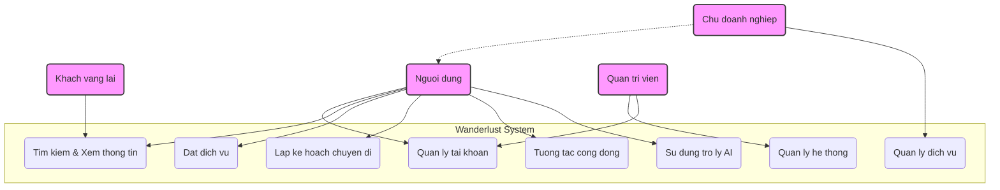

---
### **4.3. Thiết kế Cơ sở dữ liệu**

Hệ thống sử dụng Cloud Firestore, một cơ sở dữ liệu NoSQL của Firebase, làm nơi lưu trữ dữ liệu chính. Thiết kế cơ sở dữ liệu được tối ưu hóa cho việc truy vấn nhanh và khả năng mở rộng linh hoạt, với cấu trúc dựa trên các `collection` và `document`.

#### **4.3.1. Sơ đồ quan hệ dữ liệu (Schema Diagram)**

Mặc dù Firestore là NoSQL, chúng ta vẫn có thể hình dung mối quan hệ logic giữa các collection chính thông qua các tham chiếu (references). Biểu đồ dưới đây mô tả các mối quan hệ đó.

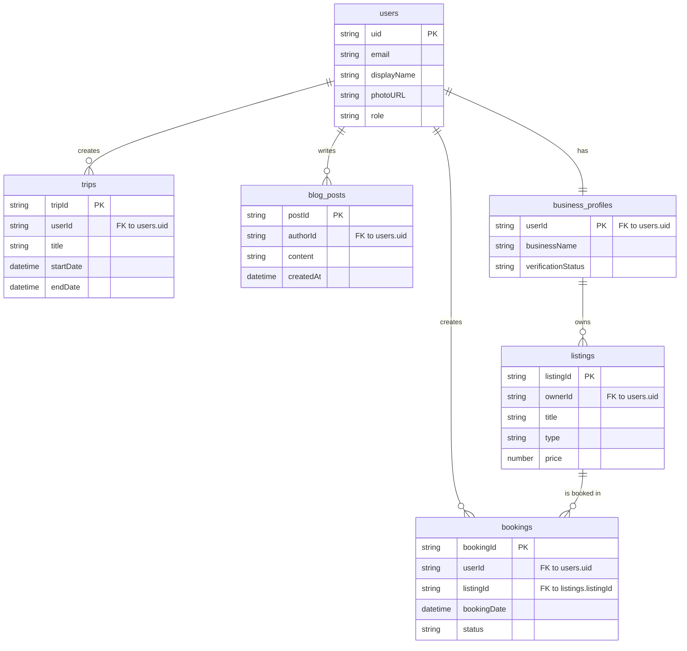

#### **4.3.2. Mô tả chi tiết các collection chính**

Dưới đây là mô tả chi tiết về mục đích và các trường dữ liệu quan trọng của các collection chính trong Firestore:

*   **`users`**
    *   **Mục đích:** Lưu trữ thông tin định danh và vai trò của tất cả người dùng trong hệ thống.
    *   **Các trường chính:**
        *   `uid` (string): ID duy nhất do Firebase Authentication cung cấp, dùng làm khóa chính.
        *   `email` (string): Địa chỉ email đăng ký của người dùng.
        *   `displayName` (string): Tên hiển thị.
        *   `photoURL` (string): URL ảnh đại diện.
        *   `role` (string): Vai trò của người dùng trong hệ thống ('user', 'business', 'admin').
        *   `createdAt` (timestamp): Thời điểm tài khoản được tạo.

*   **`business_profiles`**
    *   **Mục đích:** Lưu trữ thông tin bổ sung cho các tài khoản doanh nghiệp, dùng cho việc xét duyệt.
    *   **Các trường chính:**
        *   `userId` (string): Tham chiếu đến `uid` của người dùng trong collection `users`.
        *   `businessName` (string): Tên doanh nghiệp.
        *   `businessType` (string): Loại hình kinh doanh (khách sạn, tour,...).
        *   `verificationStatus` (string): Trạng thái xác minh ('pending', 'verified', 'rejected').
        *   `verificationDocs` (array): Mảng chứa URL các tài liệu xác minh.

*   **`listings`**
    *   **Mục đích:** Lưu trữ thông tin về tất cả các dịch vụ được cung cấp trên nền tảng (phòng khách sạn, tour du lịch,...) theo một mô hình thống nhất.
    *   **Các trường chính:**
        *   `listingId` (string): ID duy nhất của dịch vụ.
        *   `ownerId` (string): Tham chiếu đến `uid` của chủ doanh nghiệp.
        *   `type` (string): Loại hình dịch vụ ('accommodation', 'tour').
        *   `title` (string): Tên/Tiêu đề của dịch vụ.
        *   `description` (string): Mô tả chi tiết.
        *   `price` (number): Giá dịch vụ.
        *   `images` (array): Mảng chứa các URL hình ảnh.
        *   `location` (geopoint/map): Thông tin vị trí địa lý.
        *   `averageRating` (number): Điểm đánh giá trung bình.

*   **`bookings`**
    *   **Mục đích:** Ghi lại lịch sử các giao dịch đặt dịch vụ của người dùng.
    *   **Các trường chính:**
        *   `bookingId` (string): ID duy nhất của giao dịch.
        *   `userId` (string): Tham chiếu đến người dùng đặt dịch vụ.
        *   `listingId` (string): Tham chiếu đến dịch vụ được đặt.
        *   `bookingDate` (timestamp): Ngày thực hiện giao dịch.
        *   `totalPrice` (number): Tổng chi phí.
        *   `status` (string): Trạng thái giao dịch ('confirmed', 'pending', 'cancelled').

*   **`trips`**
    *   **Mục đích:** Lưu trữ các kế hoạch chuyến đi do người dùng tự tạo.
    *   **Các trường chính:**
        *   `tripId` (string): ID duy nhất của chuyến đi.
        *   `userId` (string): Tham chiếu đến người tạo chuyến đi.
        *   `title` (string): Tên chuyến đi.
        *   `startDate`, `endDate` (timestamp): Ngày bắt đầu và kết thúc.
    *   **Sub-collections (Collection con):**
        *   `itineraries`: Lưu lịch trình chi tiết cho từng ngày.
        *   `expenses`: Lưu các khoản chi tiêu trong chuyến đi.

*   **`blog_posts`**
    *   **Mục đích:** Lưu trữ các bài viết, chia sẻ kinh nghiệm do cộng đồng người dùng tạo ra.
    *   **Các trường chính:**
        *   `postId` (string): ID duy nhất của bài viết.
        *   `authorId` (string): Tham chiếu đến tác giả bài viết.
        *   `content` (string): Nội dung bài viết.
        *   `images` (array): Mảng chứa các URL hình ảnh.
        *   `createdAt` (timestamp): Thời điểm đăng bài.
        *   `likesCount` (number): Số lượt thích.

---
### **4.4. Thiết kế chi tiết (Chọn lọc)**

Phần này đi sâu vào thiết kế chi tiết của các module quan trọng, sử dụng các biểu đồ UML để minh họa kiến trúc và luồng xử lý.

#### **4.4.1. Thiết kế Tĩnh (Biểu đồ Lớp cho Module Booking)**

Để minh họa cho kiến trúc MVVM (Model-View-ViewModel) được áp dụng trong dự án thông qua GetX Pattern, chúng ta sẽ phân tích Module "Đặt phòng" (Booking). Biểu đồ lớp dưới đây thể hiện mối quan hệ và trách nhiệm của các thành phần chính khi người dùng thực hiện một thao tác đặt phòng.

*   **View (`BookingInfoPage`):** Là lớp giao diện người dùng, chịu trách nhiệm hiển thị dữ liệu và bắt các sự kiện từ người dùng (như nhấn nút "Xác nhận"). View không chứa logic nghiệp vụ, nó chỉ đơn giản là gọi các phương thức từ Controller.
*   **Controller (`BookingController`):** Đóng vai trò ViewModel, là cầu nối giữa View và logic nghiệp vụ. Nó chứa trạng thái của màn hình (dữ liệu người dùng nhập, thông tin dịch vụ) và các phương thức để xử lý sự kiện mà View gọi tới (ví dụ `confirmBooking()`).
*   **Service (`BookingService`):** Chịu trách nhiệm thực thi các nghiệp vụ cốt lõi, giao tiếp với nguồn dữ liệu (Firestore). Controller sẽ gọi đến Service để tạo, cập nhật hoặc lấy dữ liệu về booking.
*   **Model (`BookingModel`):** Là lớp biểu diễn cấu trúc dữ liệu của một đối tượng "Booking". Nó định nghĩa các thuộc tính sẽ được lưu trữ trong cơ sở dữ liệu Firestore.

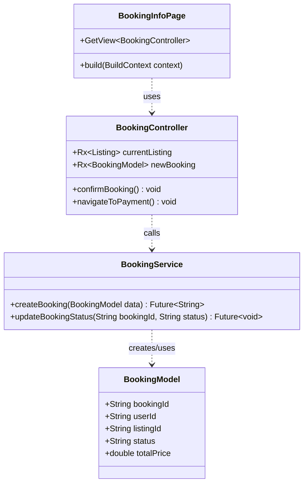

Biểu đồ trên cho thấy một luồng kiến trúc rõ ràng: `BookingInfoPage` (View) nhận hành động của người dùng và gọi đến `BookingController`. `BookingController` xử lý logic giao diện và gọi `BookingService` để thực hiện nghiệp vụ. `BookingService` sau đó tương tác với `BookingModel` và cơ sở dữ liệu để hoàn tất yêu cầu. Mô hình này giúp tách biệt rõ ràng các lớp, làm cho code dễ bảo trì và kiểm thử.

---
#### **4.4.2. Thiết kế Động (Biểu đồ Tuần tự)**

Biểu đồ tuần tự (Sequence Diagram) được sử dụng để mô tả sự tương tác giữa các đối tượng trong hệ thống theo một trật tự thời gian. Nó cho thấy các thông điệp được gửi và nhận giữa các đối tượng và trình tự chúng diễn ra.

##### **Luồng xử lý Đặt phòng (Booking Flow)**

Biểu đồ dưới đây mô tả luồng xử lý từ khi người dùng xác nhận thông tin đặt phòng cho đến khi giao dịch được hoàn tất và lưu vào cơ sở dữ liệu. Luồng này thể hiện sự phối hợp giữa giao diện người dùng, các lớp logic nghiệp vụ và cơ sở dữ liệu.

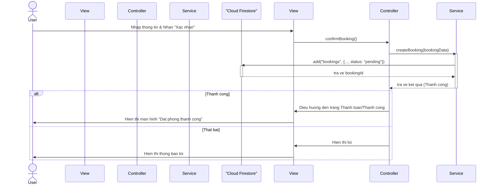

**Mô tả luồng:**
1.  **Người dùng (User)** nhập đầy đủ thông tin trên trang `BookingInfoPage` (View) và nhấn nút xác nhận.
2.  **View** bắt sự kiện này và gọi phương thức `confirmBooking()` từ `BookingController` (Controller).
3.  **Controller** tập hợp dữ liệu và gọi phương thức `createBooking()` từ `BookingService` (Service), truyền vào dữ liệu của booking.
4.  **Service** thực hiện logic nghiệp vụ chính: tạo một document mới trong collection `bookings` trên **Cloud Firestore** với trạng thái ban đầu là `"pending"`.
5.  **Cloud Firestore** sau khi lưu thành công, sẽ trả về ID của document vừa được tạo.
6.  **Service** nhận được ID, hoàn tất và trả kết quả thành công về cho **Controller**.
7.  **Controller**, dựa trên kết quả trả về, sẽ ra quyết định:
    *   Nếu thành công, nó sẽ điều hướng View sang trang thanh toán hoặc trang thông báo đặt phòng thành công.
    *   Nếu thất bại, nó sẽ gửi một tín hiệu lỗi về View để hiển thị cho người dùng.

---
##### **Luồng xử lý Chat với AI (AI Flow)**

Đây là một trong những tính năng công nghệ nổi bật của Wanderlust, tích hợp Trợ lý Du lịch Thông minh sử dụng Google Gemini API. Biểu đồ tuần tự dưới đây mô tả luồng tương tác từ khi người dùng gửi một câu hỏi cho đến khi nhận được và hiển thị câu trả lời, đồng thời lưu trữ lịch sử cuộc trò chuyện vào bộ nhớ cục bộ (local storage) của thiết bị.

*   **AIStorageService:** Là dịch vụ chịu trách nhiệm lưu và đọc lịch sử tin nhắn từ cơ sở dữ liệu cục bộ (Hive). Điều này giúp ứng dụng có thể hiển thị lại các cuộc trò chuyện trước đó ngay lập tức mà không cần gọi lại API.
*   **GeminiService:** Là lớp trung gian, chịu trách nhiệm gửi yêu cầu đến Google Gemini API và nhận kết quả trả về.

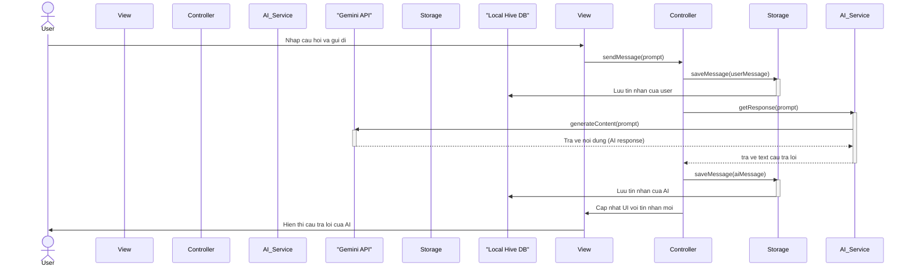

**Mô tả luồng:**
1.  **Người dùng (User)** gõ một câu hỏi vào giao diện `AIChatPage` (View) và nhấn gửi.
2.  **View** gọi phương thức `sendMessage()` ở `AIChatController` (Controller).
3.  **Controller** ngay lập tức gọi `AIStorageService` (Storage) để lưu tin nhắn của người dùng vào cơ sở dữ liệu cục bộ **Hive DB**. Điều này đảm bảo tin nhắn không bị mất.
4.  Tiếp theo, **Controller** gọi `getResponse()` ở `GeminiService` (AI Service) để lấy câu trả lời từ AI.
5.  **AI Service** gửi yêu cầu `generateContent` đến **Google Gemini API**.
6.  **Gemini API** xử lý và trả về nội dung câu trả lời.
7.  **AI Service** nhận được câu trả lời và chuyển về cho **Controller**.
8.  **Controller** làm hai việc song song:
    *   Gọi **Storage** để lưu lại tin nhắn của AI vào **Hive DB**.
    *   Cập nhật lại giao diện trên **View** để hiển thị bong bóng chat chứa câu trả lời của AI.
9.  **Người dùng** nhìn thấy câu trả lời trên màn hình.

---
### **4.5. Thiết kế Giao diện**

Phần này trình bày về thiết kế giao diện người dùng (UI) và trải nghiệm người dùng (UX) của ứng dụng Wanderlust, bao gồm sơ đồ luồng màn hình và các hình ảnh minh họa thực tế.

#### **4.5.1. Sơ đồ luồng màn hình**

Sơ đồ luồng màn hình (Screen Flow Diagram) cung cấp cái nhìn tổng quan về cách người dùng điều hướng qua các màn hình khác nhau trong ứng dụng, cũng như các mối quan hệ và đường dẫn chính giữa chúng. Nó giúp hiểu rõ cấu trúc tổ chức của ứng dụng và trải nghiệm điều hướng của người dùng.

Ứng dụng Wanderlust có cấu trúc điều hướng chính dựa trên một thanh điều hướng dưới cùng (Bottom Navigation Bar) cho các phân hệ chính, và các luồng riêng biệt cho xác thực, đặt dịch vụ và chi tiết tính năng.

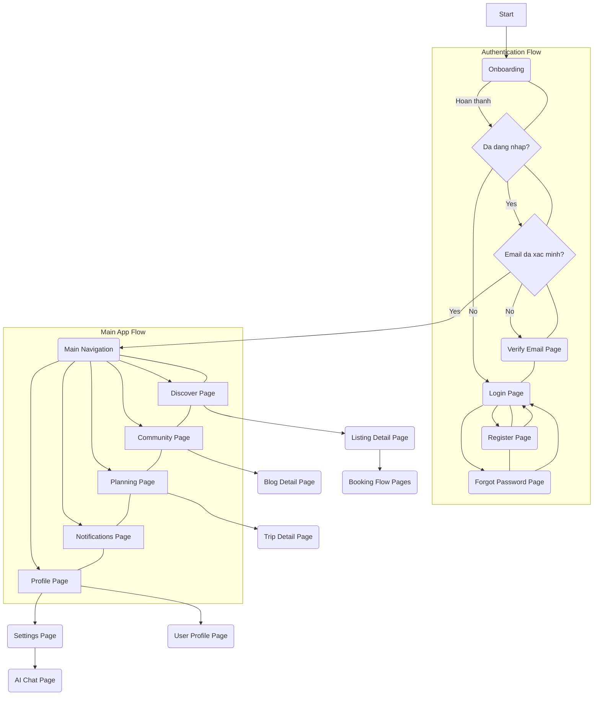

**Mô tả luồng:**
1.  **Start:** Điểm khởi đầu của ứng dụng.
2.  **Onboarding:** Người dùng mới sẽ trải qua các màn hình giới thiệu (Onboarding).
3.  **Authentication Flow:** Sau Onboarding, hệ thống kiểm tra trạng thái đăng nhập và xác minh email. Người dùng có thể đăng nhập, đăng ký hoặc khôi phục mật khẩu.
4.  **Main Navigation:** Sau khi đăng nhập và xác minh, người dùng được đưa đến màn hình điều hướng chính với 5 tab (Discover, Community, Planning, Notifications, Profile).
5.  **Chi tiết chức năng:** Từ các tab chính, người dùng có thể truy cập vào các màn hình chi tiết như Chi tiết dịch vụ, Chi tiết bài viết, Chi tiết chuyến đi, Cài đặt, Hồ sơ cá nhân.
6.  **Các luồng cụ thể:** Từ màn hình chi tiết dịch vụ có thể dẫn đến các trang trong luồng đặt phòng. Từ cài đặt có thể truy cập màn hình AI Chat.

#### **4.5.2. Hình ảnh giao diện thực tế**

Để cung cấp cái nhìn trực quan về trải nghiệm người dùng và thiết kế giao diện của ứng dụng Wanderlust, phần này trình bày các hình ảnh chụp màn hình thực tế (screenshots) từ ứng dụng. Các hình ảnh này minh họa các màn hình chính và các tính năng nổi bật, phản ánh sự tuân thủ các nguyên tắc thiết kế hiện đại và sự tiện dụng của ứng dụng.

*(Lưu ý quan trọng: Bạn cần chèn các hình ảnh thực tế của ứng dụng vào đây. Dưới đây là các gợi ý về những màn hình nên đưa vào để minh họa rõ nhất về ứng dụng.)*

*   **Màn hình Khởi động (Splash Screen) & Onboarding:** Thể hiện nhận diện thương hiệu và giới thiệu ứng dụng.
*   **Màn hình Đăng nhập (Login) / Đăng ký (Register):** Minh họa luồng xác thực người dùng.
*   **Màn hình Trang chủ (Discover Page):** Giao diện chính với các đề xuất du lịch, banner khuyến mãi.
*   **Màn hình Chi tiết địa điểm/dịch vụ (Listing Detail Page):** Hiển thị thông tin chi tiết về khách sạn, tour, v.v.
*   **Màn hình Đặt phòng (Booking Flow):** Các bước quan trọng trong quá trình đặt dịch vụ.
*   **Màn hình Lập kế hoạch chuyến đi (Trip Planning Page) / Chi tiết chuyến đi (Trip Detail):** Giao diện quản lý lịch trình và chi phí.
*   **Màn hình Cộng đồng (Community Page) & Chi tiết bài viết (Blog Detail):** Minh họa tính năng mạng xã hội.
*   **Màn hình Chat với AI (AI Chat Page):** Giao diện tương tác với trợ lý du lịch AI.
*   **Màn hình Hồ sơ cá nhân (Profile Page) & Cài đặt (Settings):** Giao diện quản lý thông tin và tùy chỉnh ứng dụng.

---
#### **4.6. Kết luận chương**

Chương này đã trình bày chi tiết về quá trình phân tích và thiết kế hệ thống cho ứng dụng Wanderlust. Bắt đầu từ việc xác định các tác nhân và yêu cầu chức năng cũng như phi chức năng, chương đã đi sâu vào việc thiết kế kiến trúc tổng thể, thiết kế cơ sở dữ liệu trên nền tảng NoSQL Cloud Firestore, và minh họa chi tiết kiến trúc bên trong cũng như các luồng xử lý động của các module quan trọng. Các thiết kế này được xây dựng nhằm đáp ứng các yêu cầu nghiệp vụ đã đề ra, đồng thời đảm bảo hiệu năng, tính bảo mật và khả năng mở rộng cho hệ thống trong tương lai. Nền tảng thiết kế này sẽ là kim chỉ nam cho quá trình triển khai và phát triển ứng dụng ở chương tiếp theo.
<hr>

##### **Luồng xử lý Đăng ký tài khoản (Register Flow)**

Biểu đồ này mô tả quá trình người dùng tạo một tài khoản mới bằng email và mật khẩu. Luồng này bao gồm việc tương tác với dịch vụ xác thực (Firebase Authentication) và lưu trữ thông tin người dùng vào cơ sở dữ liệu (Cloud Firestore).

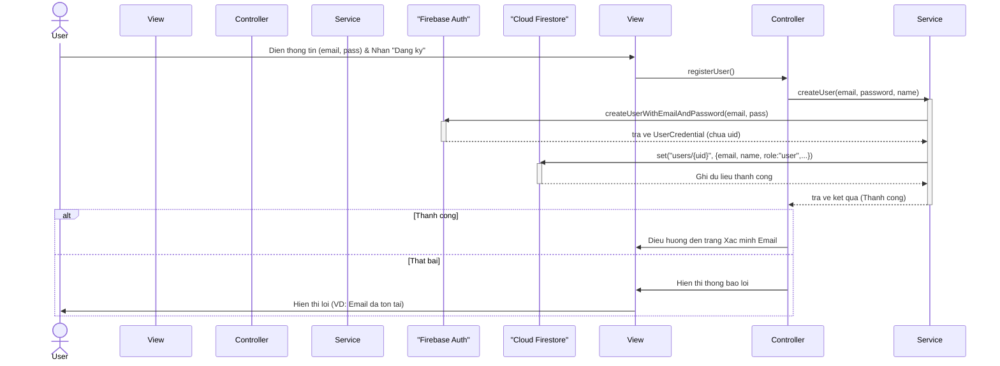

**Mô tả luồng:**
1.  **Người dùng (User)** điền thông tin vào form đăng ký trên `RegisterPage` và nhấn nút "Đăng ký".
2.  **View** gọi phương thức `registerUser()` từ `AuthController`.
3.  **Controller** gọi `createUser()` ở `AuthService`, truyền các thông tin cần thiết.
4.  **AuthService** gọi hàm `createUserWithEmailAndPassword` của **Firebase Auth**.
5.  **Firebase Auth** tạo người dùng mới trong hệ thống xác thực của nó và trả về thông tin `UserCredential` chứa `uid` duy nhất.
6.  Ngay sau đó, **AuthService** sử dụng `uid` này để tạo một document mới trong collection `users` trên **Cloud Firestore**, lưu các thông tin bổ sung như tên, vai trò mặc định là "user".
7.  Sau khi cả hai bước thành công, **Service** trả về kết quả thành công cho **Controller**.
8.  **Controller** điều hướng người dùng sang trang xác minh email. Nếu có lỗi xảy ra ở bất kỳ bước nào, lỗi sẽ được trả về và hiển thị trên giao diện.
<hr>

##### **Luồng xử lý Đăng nhập (Login Flow)**

Biểu đồ mô tả quá trình người dùng đăng nhập vào hệ thống bằng email và mật khẩu. Luồng này chỉ cần tương tác với dịch vụ Firebase Authentication để xác thực thông tin đăng nhập.

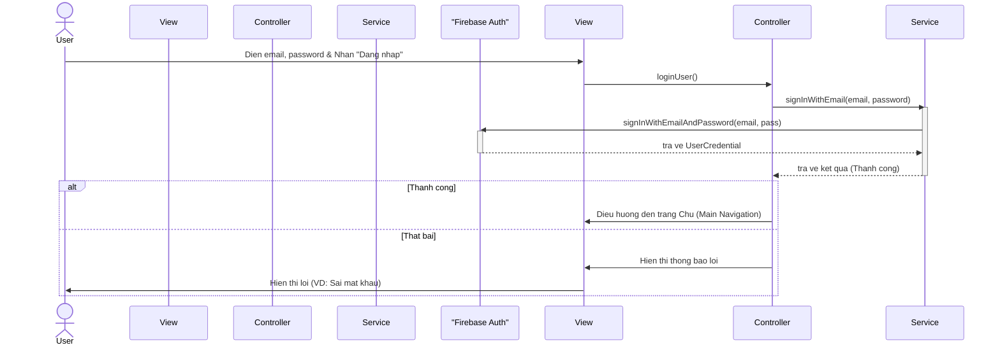

**Mô tả luồng:**
1.  **Người dùng (User)** nhập email, mật khẩu trên `LoginPage` và nhấn "Đăng nhập".
2.  **View** gọi phương thức `loginUser()` trên `AuthController`.
3.  **Controller** gọi `signInWithEmail()` ở `AuthService`.
4.  **AuthService** gọi phương thức `signInWithEmailAndPassword` của **Firebase Auth**.
5.  **Firebase Auth** xác thực thông tin. Nếu hợp lệ, nó trả về thông tin người dùng.
6.  **AuthService** trả kết quả về cho **Controller**.
7.  **Controller** xử lý kết quả:
    *   Nếu đăng nhập thành công, điều hướng người dùng vào màn hình chính của ứng dụng.
    *   Nếu thất bại, yêu cầu View hiển thị thông báo lỗi.
<hr>

##### **Luồng xử lý Quên mật khẩu (Forgot Password Flow)**

Biểu đồ mô tả quá trình người dùng yêu cầu đặt lại mật khẩu. Hệ thống sẽ sử dụng tính năng có sẵn của Firebase Authentication để gửi email hướng dẫn cho người dùng.

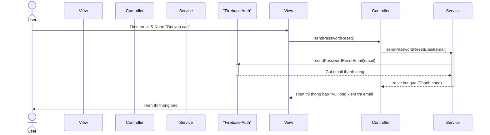

**Mô tả luồng:**
1.  **Người dùng (User)** nhập địa chỉ email đã đăng ký vào trang `ForgotPasswordPage` và nhấn nút "Gửi yêu cầu".
2.  **View** gọi phương thức `sendPasswordReset()` từ `AuthController`.
3.  **Controller** gọi `sendPasswordResetEmail()` ở `AuthService`.
4.  **AuthService** gọi hàm `sendPasswordResetEmail` của **Firebase Auth**.
5.  **Firebase Auth** tự động xử lý việc gửi email có chứa đường link để đặt lại mật khẩu tới địa chỉ email của người dùng.
6.  Sau khi gửi yêu cầu thành công, **AuthService** trả kết quả về cho **Controller**.
7.  **Controller** yêu cầu **View** hiển thị một thông báo cho người dùng, hướng dẫn họ kiểm tra hộp thư đến để làm theo các bước tiếp theo.
<hr>

##### **Luồng xử lý Cập nhật Hồ sơ & Avatar (Update Profile & Avatar Flow)**

Biểu đồ này mô tả hai hành động chính trên trang chỉnh sửa hồ sơ: cập nhật thông tin văn bản (như tên hiển thị) và thay đổi ảnh đại diện (avatar). Việc thay đổi avatar là một luồng phức tạp hơn vì nó yêu cầu tương tác với cả bộ nhớ của thiết bị, dịch vụ lưu trữ file (Firebase Storage) và cơ sở dữ liệu (Cloud Firestore).

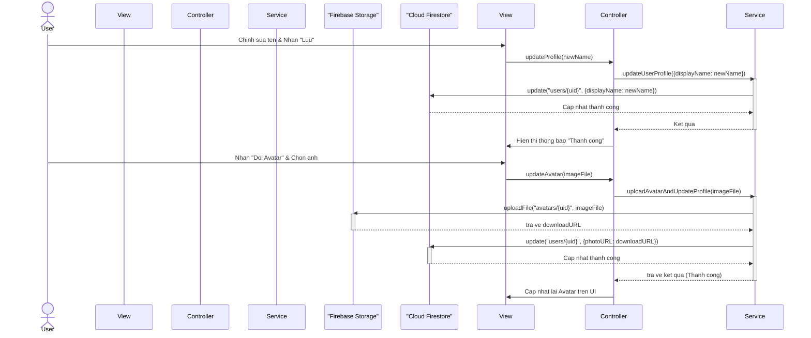

**Mô tả luồng Cập nhật thông tin:**
1.  Người dùng chỉnh sửa các trường thông tin (ví dụ: `displayName`) và nhấn "Lưu".
2.  **View** gọi `updateProfile()` trên `ProfileController`.
3.  **Controller** gọi `updateUserProfile()` ở `UserService`.
4.  **UserService** gửi lệnh `update` đến **Cloud Firestore** để cập nhật document của người dùng.

**Mô tả luồng Đổi Avatar:**
1.  Người dùng nhấn "Đổi Avatar" và chọn một ảnh từ thiết bị.
2.  **View** gọi `updateAvatar()` trên `ProfileController` với file ảnh đã chọn.
3.  **Controller** gọi một phương thức xử lý ở `UserService`.
4.  **UserService** thực hiện 2 bước:
    a. Tải file ảnh lên **Firebase Storage**.
    b. Sau khi tải lên thành công, **Firebase Storage** trả về một `downloadURL`.
5.  **UserService** dùng `downloadURL` này để cập nhật trường `photoURL` trong document của người dùng trên **Cloud Firestore**.
6.  Sau khi hoàn tất, **Controller** cập nhật lại giao diện để hiển thị avatar mới.
<hr>

##### **Luồng xử lý Tạo chuyến đi mới (Create Trip Flow)**

Đây là một trong những tính năng cốt lõi, cho phép người dùng tạo ra một kế hoạch du lịch mới. Luồng này khá đơn giản, chủ yếu là ghi thông tin ban đầu của chuyến đi vào cơ sở dữ liệu.

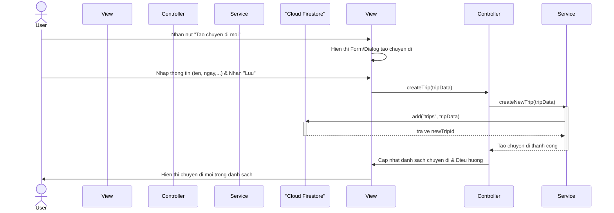

**Mô tả luồng:**
1.  **Người dùng (User)** nhấn nút "Tạo chuyến đi mới" trên trang quản lý các chuyến đi.
2.  **View** hiển thị một form hoặc dialog để người dùng nhập thông tin cơ bản như tên chuyến đi, ngày bắt đầu, ngày kết thúc.
3.  Sau khi nhập xong, người dùng nhấn "Lưu".
4.  **View** gọi phương thức `createTrip()` trên `TripController`, truyền vào dữ liệu người dùng đã nhập.
5.  **Controller** gọi `createNewTrip()` ở `TripService`.
6.  **TripService** tạo một document mới trong collection `trips` trên **Cloud Firestore**.
7.  Sau khi tạo thành công, **Controller** cập nhật lại danh sách các chuyến đi và có thể điều hướng người dùng đến trang chi tiết của chuyến đi vừa tạo.
8.  **View** hiển thị chuyến đi mới trong danh sách.
<hr>

##### **Luồng xử lý Đăng bài viết mới (Create Blog Post Flow)**

Biểu đồ này mô tả quá trình người dùng tạo một bài viết chia sẻ kinh nghiệm mới. Tương tự như luồng cập nhật avatar, nó bao gồm cả việc xử lý nội dung văn bản và tải lên các tệp hình ảnh.

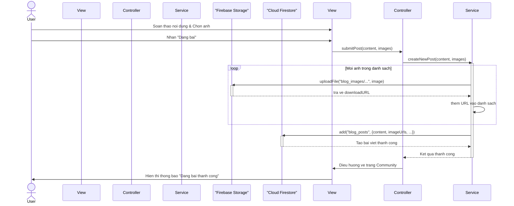

**Mô tả luồng:**
1.  **Người dùng (User)** soạn thảo nội dung, chọn các hình ảnh minh họa trên trang `CreatePostPage` và nhấn "Đăng bài".
2.  **View** gọi phương thức `submitPost()` trên `PostController`.
3.  **Controller** gọi `createNewPost()` ở `BlogService`, truyền vào nội dung và danh sách các file ảnh.
4.  **BlogService** bắt đầu xử lý:
    a. Nó lặp qua từng file ảnh mà người dùng đã chọn.
    b. Với mỗi ảnh, nó tải file lên **Firebase Storage**.
    c. Sau khi tải lên thành công, **Firebase Storage** trả về một `downloadURL`.
    d. `BlogService` thu thập tất cả các `downloadURL` này vào một danh sách.
5.  Sau khi đã tải lên tất cả các ảnh, **BlogService** tạo một document mới trong collection `blog_posts` trên **Cloud Firestore**. Document này chứa nội dung bài viết, danh sách các URL ảnh, ID tác giả, và các thông tin khác.
6.  Khi ghi vào Firestore thành công, **Service** trả kết quả về cho **Controller**.
7.  **Controller** điều hướng người dùng quay trở lại trang Cộng đồng và **View** hiển thị thông báo thành công.